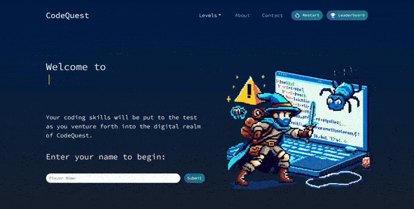
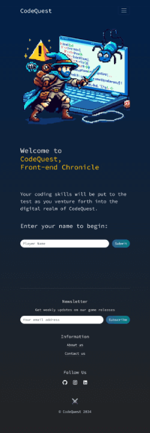

# CodeQuest

## Module 14 Final Project

## Table of Contents

- [Overview](#overview)
- [Screenshots](#screenshots)
- [Links](#links)
- [Built With](#built-with)
- [Authors](#authors)
- [Credits](#credits)

## Overview

CodeQuest is a web game that allows you to test your knowledge of JavaScript, HTML, and Bootstrap. The game is designed to make learning fun and interactive. As you play, you can earn points for completing challenges, and you can see your total score.

In CodeQuest, you can also check the leaderboard to see how you compare to other players. Whether you're just starting out or looking to improve your coding skills, CodeQuest offers an enjoyable way to learn and compete with others. Join us in this exciting adventure to become a coding master!

## Screenshots

### Desktop:

### Mobile:

### Links

- [GitHub Repo](https://github.com/obutsan/code-quiz)
- [Live Link](https://codeeequest.netlify.app/)

### Built With

### Libraries

- Bootstrap [npm package](https://www.npmjs.com/package/bootstrap)
- Fontsource
- Material UI Icons [npm package](https://www.npmjs.com/package/@mui/icons-material)
- Popper.js [npm package](https://www.npmjs.com/package/@popperjs/core)
- React Bootstrap [npm package](https://www.npmjs.com/package/react-bootstrap)
- React Hot Toast [npm package](https://www.npmjs.com/package/react-hot-toast)
- React Router Dom [npm package](https://www.npmjs.com/package/react-router-dom)
- React Toastify [npm package](https://www.npmjs.com/package/react-toastify)
- Supabase [supabase.com](https://supabase.com/toas)
- Typewriter Effect [npm package](https://www.npmjs.com/package/typewriter-effect)
- UUID [npm package](https://www.npmjs.com/package/uuid)

## Authors

- Olha Pobedynska
  - [GitHub](https://github.com/obutsan)
  - [LinkedIn](https://www.linkedin.com/in/olga-pobedynska)

- Aoife Dunphy

  - [GitHub](https://github.com/AoifeEdX)
  - [LinkedIn](https://www.linkedin.com/in/aoifenidhonnacha/)

- Szilvia Horvath

  - [GitHub](https://github.com/hszilvi)
  - [LinkedIn](https://www.linkedin.com/in/horvathszilvi/)

### Credits

<b>Resources</b>

- Internet Archive API
- GitHub Languages API
- Google Script API
- Supabase SQL

